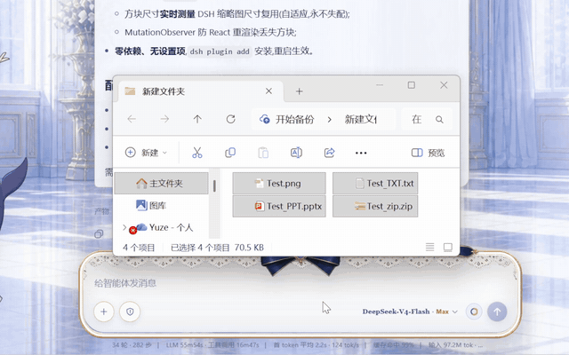
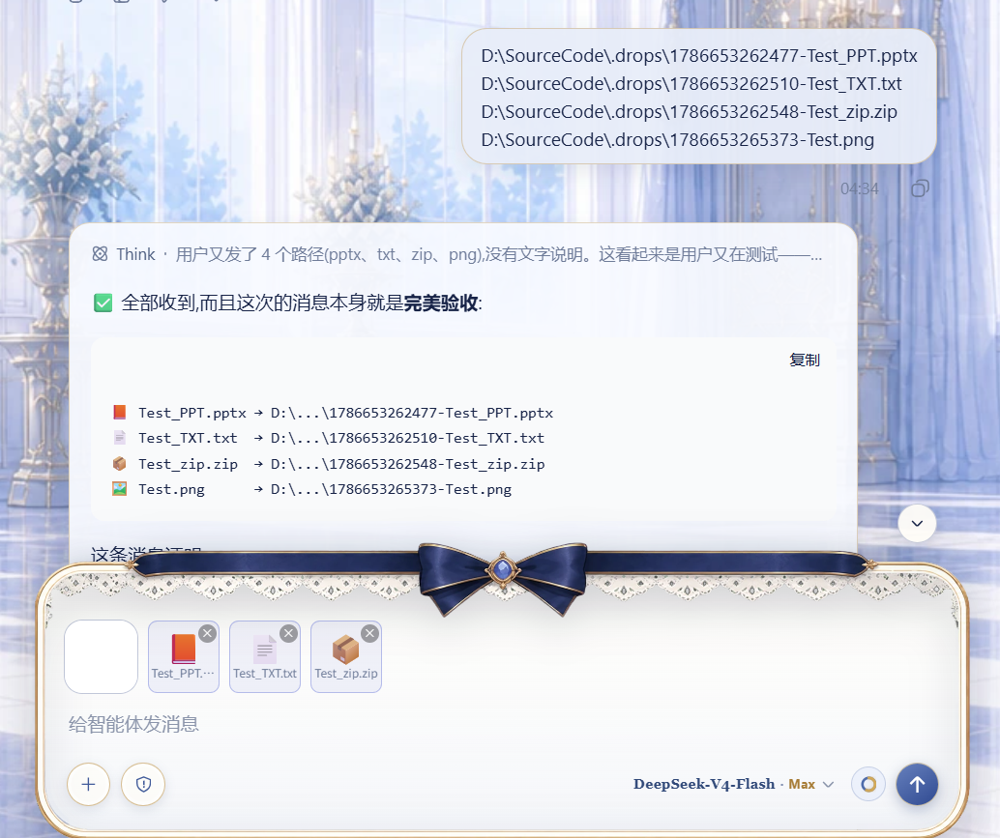
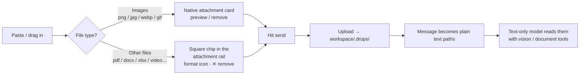

# dsh-drop-to-path

> Drop or paste images, PDFs, office docs, zips, videos and audio into DeepSeek Harness — they reach your text-only model as **workspace file paths**. Images keep the native attachment UI (preview / remove), everything else shows as square chips in the attachment rail, and paths are appended automatically when you hit send.

[English](README.md) | [中文](README.zh.md)

[](https://github.com/topics/dsh-plugin)

## Demo



*Drag images / PPT / TXT / ZIP into the composer → square file chips appear next to image thumbnails → hit send → the model receives workspace file paths.*



*The effect: images and files arrive at the text-only model as workspace paths, ready for vision / document tools.*

## Why this plugin

I use a text-only model (deepseek) in DeepSeek Harness and frequently need to send screenshots to the agent. But DSH image attachments go through the model's native attachment channel, and text-only models are rejected by a preflight check before the message is even sent — the composer shows a system toast:

> **The current model does not support images; switch to a model that does.**


Backed by the host image-admission preflight (`attachment-error`):

```
Model "deepseek-v4-flash" does not support image input.
```

[dsh-vision-toolkit](https://github.com/Anionex/dsh-vision-toolkit) solves the "see the image" half — but its tools only accept **workspace file paths**, so the image must enter the message as a path. Every screenshot became: save to workspace → manually type the path into the message. Painful. And beyond images, DSH refuses to attach PDFs, office documents, videos or any non-image file at all.

After experiencing "paste and go" in another tool, I decided to bring that experience back to DSH: **keep the attachment UI completely native, and convert images *and* files to paths only at the moment of sending**. Hence this plugin.

## How it works



- The image admission preflight (`attachment-error` in `dsh-host-apiproxy`) is **bypassed**: no image block is ever sent, the model only sees text.
- Nothing is typed into the composer while you add files — paths are appended **on send**, exactly like the image conversion.
- Upload failure is never silent: a visible notice explains what happened before falling back to the native send path; messages are never swallowed.
- Supports paste and drag-and-drop; images, files and mixed batches are uploaded in order and sent as one text block of paths.

## Supported file types

| Type | Extensions | Limit | Experience |
|---|---|---|---|
| Images | `png` `jpg` `jpeg` `webp` `gif` | 30MB | Native attachment card (preview / remove), auto-converted to paths on send |
| Documents | `pdf` `doc` `docx` `xls` `xlsx` `ppt` `pptx` `txt` `md` `csv` `json` | 100MB | Square chip in the attachment rail (format icon, full name on hover, ✕ to remove), path appended on send |
| Archives | `zip` | 100MB | Same |
| Video | `mp4` `mov` `webm` `mkv` `avi` | 100MB | Same |
| Audio | `mp3` `wav` `flac` `m4a` | 100MB | Same |

> Images keep the native attachment experience. DSH itself only accepts these image formats as attachments (see the toast below) and refuses everything else — this plugin turns the rest into plain workspace paths instead, so the agent can process them with PDF / document tools.


## Pairing with dsh-vision-toolkit (recommended)

> 🎯 **Strongly recommended to pair with [dsh-vision-toolkit](https://github.com/Anionex/dsh-vision-toolkit)** — it is the eyes of a text-only model, this plugin is the conveyor belt:
>
> - **This plugin** solves "how an image or file becomes a path" (automatic conversion on send);
> - **dsh-vision-toolkit** solves "how a path becomes vision capability" (intent-aware image Q&A, long-screenshot OCR, UI restoration, grounding, pixel diff — 10 structured vision tools, with DSH Credentials / managed runtime / Web Settings).
>
> Install: `dsh plugin --profile web add <path-to-dsh-vision-toolkit>` (see its repo README). Together they give a text-only model an experience close to a native multimodal model.

| Scenario | Before | Now |
|---|---|---|
| Image Q&A | screenshot → save to workspace → type path | screenshot → Ctrl+V → Enter |
| Multi-image diff (pixel diff) | same, type every path | just send two images |
| Long-screenshot OCR / UI restoration | same | just send the image |
| Analyze a PDF / xlsx / video | copy it into the workspace, type the path | just drag it in and send |

## Comparison with similar plugins

- [dsh-drag-and-drop](https://github.com/bill9109/dsh-drag-and-drop): dropping a file inserts its **raw path** into the composer, no file copying. Great for referencing files already in the workspace; images are still sent as attachments (still rejected by text-only models), and paste is not supported.
- **This plugin**: keeps the native attachment UI (preview / remove), **automatically copies images and files to the workspace and converts them to paths on send**, supports paste and drag-and-drop, and shows non-image files as removable square chips in the attachment rail. Built for "sending images and files to a text-only model".

They are complementary: use dsh-drag-and-drop to reference existing files, use this plugin to send screenshots and new files.

## Installation

Requirements: DeepSeek Harness (Web profile), Node.js, `dsh` CLI.

```sh
# Option 1: install via dsh plugin (recommended)
dsh plugin --profile web add /path/to/dsh-drop-to-path

# Option 2: manual (matches this repo layout)
# 1. add to dependencies in package.json:
#    "@dsh-external/dsh-drop-to-path": "link:/path/to/dsh-drop-to-path"
# 2. add to dsh.profile.bundles: "@dsh-external/dsh-drop-to-path"
# 3. copy the directory (including lib/) into profiles/<name>/node_modules/@dsh-external/dsh-drop-to-path
```

**Restart the Web profile** after installing (relaunch the launcher / restart `dsh web`). No settings to configure.

## Usage

1. Paste or drop images as usual — the attachment cards behave natively (preview / remove);
2. Drag or paste any other file (pdf / office / zip / video / audio) — a square chip with a format icon appears in the attachment rail next to the image thumbnails (full name on hover, ✕ to remove);
3. Type your message (optional) and hit send — no attachments are sent; images and files are uploaded and their workspace paths are appended to the message automatically;
4. The agent (paired with dsh-vision-toolkit) reads images with `vision_glance` / `vision_pixel_diff` and friends, and handles documents with PDF / spreadsheet tools.

Files are stored under `<workspace>/.drops/`; clean them up whenever you like.

## File structure

```
dsh-drop-to-path/
├─ package.json        bundle manifest (dsh.bundle.patch / dsh.client)
├─ cordis.patch.yml    mount row (insert drop-to-path)
├─ lib/
│  ├─ index.js         host:POST /_dsh/drop-to-path/import route
│  └─ client.js        browser: interception + sendSession wrapper + chips
├─ assets/             demo GIF, combined effect image, social preview, toasts
├─ README.md
├─ README.zh.md
└─ ADAPTING.md         upgrade adaptation guide (read before upgrading DSH)
```

## Implementation notes

- **host side** (`lib/index.js`): registers the `webServer` route `POST /_dsh/drop-to-path/import`, accepts `{ name, dataBase64 }`, validates (whitelisted extensions; images ≤30MB, other files ≤100MB; Unicode-safe sanitized file names against path traversal), writes into the session workspace `.drops/`, returns `{ ok, value: { path, kind } }`.
- **Workspace resolution**: reads `$DSH_HOME/storages/workspace.json` (the durable workspace registry) and picks the workspace with the newest `updatedAt`.
- **browser side** (`lib/client.js`):
  - pure-image drops pass through untouched (native rail + overlay handling);
  - drops/pastes that contain non-image files are intercepted: files upload in order, chips are rendered, and a synthetic `dragend` closes DSH's full-screen drop overlay so the page never gets stuck;
  - `conversation.sendSession` is wrapped on the ConversationController **prototype** (survives instance recreation): on send, image attachments and queued files are uploaded and their paths are joined with your text into one message;
  - chips are square tiles sized **live from the measured image-thumbnail size** (falls back to 62px), with per-format icons/colors and a MutationObserver that re-renders them after React updates;
  - after a successful send the chips clear; upload failures show a visible notice and fall back to the native send path — messages are never lost.

## Compatibility

| DSH version | Status |
|---|---|
| 0.1.0-rc.6 (verified in this repo's environment) | ✅ Works |

This plugin depends on several **undocumented internal interfaces** of DSH (service names, method signatures, storage formats) and may break after a DSH upgrade. Read [`ADAPTING.md`](ADAPTING.md) before upgrading — it contains the failure symptoms and the fix steps.

## Contributing & adapting

- Issues / ideas: GitHub Issues.
- Plugin broken after a DSH upgrade: follow the symptom table in [`ADAPTING.md`](ADAPTING.md), fix, and append a row to the adaptation log.

## License

MIT
