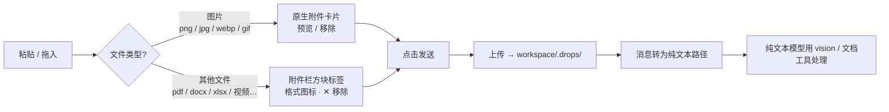

# dsh-drop-to-path

> 把图片、PDF、Office 文档、压缩包、视频、音频拖入或粘贴进 DeepSeek Harness,它们就会以**工作区文件路径**的形式送到纯文本模型面前:图片保留原生附件体验(预览/移除),其他文件显示为附件栏里的方块标签,点击发送时路径自动附加进消息。

[English](README.md) | [中文](README.zh.md)

[](https://github.com/topics/dsh-plugin)

## 演示


*拖入图片、PPT、TXT、ZIP → 附件栏出现文件方块(与图片缩略图并排)→ 点击发送 → 模型收到工作区文件路径*


*效果:图片与文件以工作区路径送达纯文本模型,配合 vision / 文档工具即可读取。*

## 为什么做这个

我在 DeepSeek Harness 里用纯文本模型(deepseek)写代码,需要经常把截图发给 Agent 看。但 DSH 的图片附件走模型原生附件通道,纯文本模型会在发送前被预检拦下,输入框直接弹出系统提示:

> **当前模型不支持图片,请切换支持图片的模型**


底层是宿主的图片准入预检(`attachment-error`):

```
Model "deepseek-v4-flash" does not support image input.
```

配合 [dsh-vision-toolkit](https://github.com/Anionex/dsh-vision-toolkit) 可以解决"看图"的问题——但它的工具只认**工作区文件路径**,图片必须以路径形式进入消息。于是每次看图都要:截图 → 存到工作区 → 手动把地址写进消息。非常笨重。而除了图片之外,DSH 根本不允许把 PDF、Office 文档、视频等任何非图片文件作为附件发送。

在另一个工具里体验过"粘贴即用"之后,我决定把这个体验搬回 DSH:**附件 UI 完全保持原生,图片和文件只在点击发送的瞬间转换成路径**。于是有了这个插件。

## 工作原理



- 图片准入预检(`dsh-host-apiproxy` 的 `attachment-error`)被**绕过**:发送时根本没有 image 块,模型收到的全是文本。
- 添加文件时**不会往输入框写任何路径**——路径在点击发送时才自动附加,和图片转换完全一致。
- 上传失败绝不静默:弹出**可见提示**说明原因,再回退到原生发送,消息不会丢失。
- 支持粘贴与拖入;图片、文件、混合批次都按顺序上传,以一段路径文本一次送达。

## 支持的文件类型

| 类型 | 扩展名 | 上限 | 体验 |
|---|---|---|---|
| 图片 | `png` `jpg` `jpeg` `webp` `gif` | 30MB | 原生附件卡片(预览/移除),发送时自动转路径 |
| 文档 | `pdf` `doc` `docx` `xls` `xlsx` `ppt` `pptx` `txt` `md` `csv` `json` | 100MB | 附件栏方块标签(格式图标、hover 显全名、✕ 移除),发送时附加路径 |
| 压缩包 | `zip` | 100MB | 同上 |
| 视频 | `mp4` `mov` `webm` `mkv` `avi` | 100MB | 同上 |
| 音频 | `mp3` `wav` `flac` `m4a` | 100MB | 同上 |

> 图片保持原生附件体验;非图片文件 DSH 本身不允许作为附件发送,本插件把它们变成附件栏方块,发送时自动附加路径——不需要预览,Agent 拿到路径后可用 PDF/文档解析等工具处理。


## 与 dsh-vision-toolkit 配合(推荐搭配)

> 🎯 **强烈推荐搭配 [dsh-vision-toolkit](https://github.com/Anionex/dsh-vision-toolkit) 一起使用**——它是纯文本模型的眼睛,本插件是传送带:
>
> - **本插件**解决"图片或文件怎么变成路径"(发送时自动转换);
> - **dsh-vision-toolkit** 解决"路径怎么变成视觉能力"(图片问答、长截图 OCR、UI 还原、目标定位、像素对比等 10 个结构化视觉工具,已适配 DSH Credentials / 托管运行时 / Web Settings)。
>
> 安装:`dsh plugin --profile web add <dsh-vision-toolkit 路径>`(详见其仓库 README)。两者配合,纯文本模型即可获得接近多模态模型的看图体验。

| 场景 | 之前 | 现在 |
|---|---|---|
| 看图问答 | 截图 → 存工作区 → 手写路径 | 截图 → Ctrl+V → 回车 |
| 多图对比(pixel diff) | 同上,每个路径手写 | 发两张图即可 |
| 长截图 OCR / UI 还原 | 同上 | 发图即可 |
| 分析 PDF / xlsx / 视频 | 拷进工作区,手写路径 | 直接拖入,发送即可 |

## 同类插件对比

- [dsh-drag-and-drop](https://github.com/bill9109/dsh-drag-and-drop):拖放文件→直接在输入框插入**原始路径**,不复制文件。适合"引用工作区已有文件";图片仍会以附件形式发送(纯文本模型下仍会被拒),且不支持粘贴。
- **本插件**:保留原生附件 UI(预览/移除),**自动把图片和文件复制到工作区、发送时转成路径**,支持粘贴与拖入,非图片文件以可移除的方块标签显示在附件栏。专为"发图发文件给纯文本模型"设计。

两者互补:引用已有文件用 dsh-drag-and-drop,发送截图和新文件用本插件。

## 安装

前置:DeepSeek Harness(Web profile),Node.js,`dsh` CLI。

```sh
# 方式一:dsh plugin 安装(推荐)
dsh plugin --profile web add /path/to/dsh-drop-to-path

# 方式二:手动(与本仓库 layout 一致)
# 1. package.json 的 dependencies 加:
#    "@dsh-external/dsh-drop-to-path": "link:/path/to/dsh-drop-to-path"
# 2. dsh.profile.bundles 数组加: "@dsh-external/dsh-drop-to-path"
# 3. 将目录(含 lib/)复制到 profiles/<name>/node_modules/@dsh-external/dsh-drop-to-path
```

安装后**重启 Web profile**(双击启动器 / 重启 `dsh web`)生效。无任何设置项。

## 使用

1. 像平时一样粘贴或拖入图片,附件卡片照常显示(可预览、可叉掉);
2. 拖入或粘贴其他文件(pdf / office / zip / 视频 / 音频)——附件栏出现带格式图标的方块标签,与图片缩略图并排(hover 显示全名,✕ 移除);
3. 输入文字(可选)后发送 —— 不发送任何附件;图片和文件被上传,工作区路径自动附加进消息;
4. agent(配合 dsh-vision-toolkit)用 `vision_glance` / `vision_pixel_diff` 等读取图片,用 PDF/表格工具处理文档。

文件保存在 `<workspace>/.drops/` 目录,可定期清理。

## 文件结构

```
dsh-drop-to-path/
├─ package.json        bundle 声明(dsh.bundle.patch / dsh.client)
├─ cordis.patch.yml    挂载行(insert drop-to-path)
├─ lib/
│  ├─ index.js         host:POST /_dsh/drop-to-path/import 路由
│  └─ client.js        browser:拦截 + sendSession 包装 + 方块标签
├─ assets/             演示 GIF、效果拼接图、social preview、报错截图
├─ README.md
├─ README.zh.md
└─ ADAPTING.md         升级适配指南(必读)
```

## 实现要点

- **host 侧**(`lib/index.js`):注册 `webServer` 服务路由 `POST /_dsh/drop-to-path/import`,接收 `{ name, dataBase64 }`,校验(扩展名白名单;图片 ≤30MB、其他文件 ≤100MB;Unicode 安全文件名清洗防路径穿越),写入会话工作区 `.drops/`,返回 `{ ok, value: { path, kind } }`。
- **工作区定位**:读取 `$DSH_HOME/storages/workspace.json`(durable workspace registry),取 `updatedAt` 最新的 workspace 路径。
- **browser 侧**(`lib/client.js`):
  - 纯图片拖放**完全放行**原生流程(附件栏 + 蒙版关闭);
  - 含非图片文件的拖放/粘贴被拦截:按顺序上传、渲染方块标签,并派发合成 `dragend` 关闭 DSH 全屏拖拽蒙版(页面不会卡住);
  - 在 `conversation.sendSession` 的**原型**上包装(实例重建也不失效):发送时把图片附件和文件队列一起上传,路径与你的文字合并为一条消息;
  - 方块标签尺寸**实时测量**图片缩略图大小(默认 62px),带格式图标/配色;MutationObserver 保证 React 重渲染后标签不丢;
  - 发送成功后标签自动清空;上传失败弹出可见提示并回退原生发送,消息不会丢失。

## 兼容性

| DSH 版本 | 状态 |
|---|---|
| 0.1.0-rc.6(本仓库验证环境) | ✅ 可用 |

本插件依赖 DSH 若干**未公开的内部接口**(服务名、方法签名、存储格式),DSH 升级后可能失效。升级前请先阅读 [`ADAPTING.md`](ADAPTING.md),失效症状与修复步骤都在里面。

## 贡献与适配

- 问题/想法:GitHub Issues。
- DSH 升级后插件失效:对照 [`ADAPTING.md`](ADAPTING.md) 的症状表排查修复,并在适配记录表追加一行。

## 许可证

MIT
