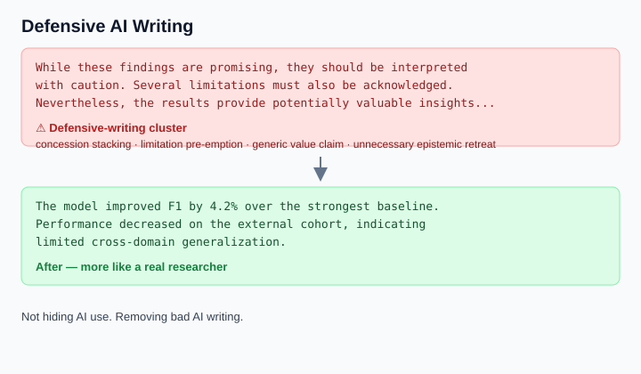
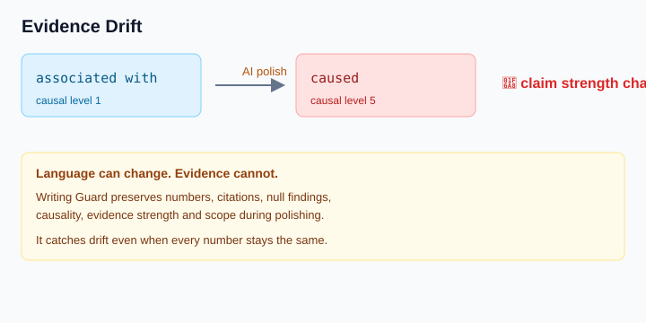
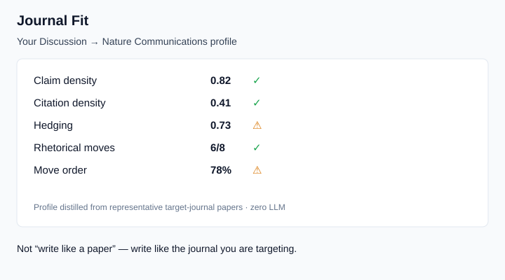

# DSH Writing Guard

[](https://awesome-dsh-plugin.com)
[](https://github.com/xmutfyh/dsh-plugin-writing-guard/actions/workflows/ci.yml)

> DeepSeek Harness (DSH) 论文写作守卫：在论文撰写和修改过程中自动检查常见 AI 写作风格、
> 修改残留、防御性表达与机械化句式，并在润色时保护科研事实与科学主张完整性
> （Scholarship Lock + Epistemic Lock——数字、引用、主张强度、否定/零结果、scope 边界都不许被语言修改悄悄改变）。

**适用于：中文论文、英文论文、SCI manuscript、毕业论文、学术写作与论文润色。**

---

## 一句话定位

**Writing Guard：去掉 AI 写作痕迹，守住科学证据，写向目标期刊。**

> 少一点 AI 腔，多一点证据，更贴近目标期刊。
>
> **Language can change. Evidence cannot.**

我们不做“AI 检测器绕行工具”，而是：

> **不是隐藏 AI，而是消除 AI 带来的坏写作。**

## 三大支柱

1. **去掉 AI 式防御性写作**
   不是简单替换几个“AI 高频词”，而是识别并减少 `concession stacking`、`limitation pre-emption`、`generic value claim`、`unnecessary epistemic retreat` 这类“正确但没必要”的防御性学术写作。
   > AI 越强，越会写“正确但没必要”的句子。

2. **守住科学证据**
   数字不能漂移、p 值不变、null finding 不消失、correlation 不能变 causation、citation claim 必须匹配证据、scope 不能被泛化。语言可以改，证据不能改。

3. **写向目标期刊**
   不是“写得像论文”，而是“写得像你要投的那本期刊”。从目标期刊代表论文中蒸馏写作分布，输出 Journal Fit，让润色结果更贴合 Nature Communications / IEEE TMI / Applied Energy / Journal of Cleaner Production 等真实投稿场景。

### Before / After 一眼看懂

**Before（典型的 AI 式防御性写作）**

```text
While these findings are promising, they should be interpreted
with caution. Several limitations must also be acknowledged.
Nevertheless, the results provide potentially valuable insights...
```

**Writing Guard 检测**

```text
⚠ Defensive-writing cluster
- concession stacking
- limitation pre-emption
- generic value claim
- unnecessary epistemic retreat
```

**After（更像一个真正写论文的人）**

```text
The model improved F1 by 4.2% over the strongest baseline.
Performance decreased on the external cohort, indicating
limited cross-domain generalization.
```

### 输出结构：STYLE / EVIDENCE / JOURNAL

产品输出统一分成三类，用户一眼就知道问题属于哪一层：

| 分类 | 回答的问题 |
|---|---|
| **STYLE** | 这句话是不是太 AI？ |
| **EVIDENCE** | 这句话有没有把 science 改掉？ |
| **JOURNAL** | 这句话适不适合我要投的期刊？ |

### 效果演示（Demos）







---

如果你正在寻找：

- DSH 论文去 AI 味插件
- DeepSeek Harness 学术写作插件
- AI writing style checker for academic papers
- academic writing guard / manuscript proofreading
- 论文 AI 痕迹检查
- SCI 写作 AI 味检查

这个插件的定位不是在论文写完之后进行一次"大规模 Humanize"，而是：

**写作前提供规则 → 写作过程中自动守卫 → 修改后自动审计。**

它提供四个 DSH 原生工具：

- `writing_rules`：写作前加载学术写作纪律
- `writing_audit`：检查论文中的 AI-style patterns、revision residue、defensive writing、LLM 高频表达及结构化写作痕迹；v0.6 起支持 Scholarship Lock（传 `original` 对比润色前后科研事实）与作者风格档案（`styleProfile`）；v1.4 起支持 Journal Profile（`journalProfile`）做目标期刊写作契合度；v0.8 起自动路径直接启用双锁（见下）
- `writing_style_profile`：从作者历史论文统计写作风格指标（句长/密度），零 LLM
- `writing_journal_profile`：从目标期刊代表论文蒸馏写作分布（Journal Profile），零 LLM

并支持在 `.md` / `.tex` / `.txt` 论文文件被 `write` / `edit` 修改后自动执行审计（v0.5 增量模式），
将高风险问题反馈给 Agent。**v0.8 起自动审计自动捕获修改前的文本**（`tools/pre-execute` 快照 +
持久化基线缓存），每次写入后直接运行 Scholarship Lock + Epistemic Lock——不需要手动传 `original`。

> 定位：不是 "AI 检测器"，而是一个知道自己在检查什么文档、能解释"为什么报"的写作 linter。
> 所有规则为本地正则/统计，零网络、零 LLM 调用，毫秒级返回。

## Why Writing Guard instead of a Humanizer?

| | Writing Guard | Humanizer | AI Detector |
|---|---|---|---|
| 写作前规则 | ✅ | ❌ | ❌ |
| 写作过程中检查 | ✅ | 通常 ❌ | ❌ |
| 自动监听论文修改 | ✅ | ❌ | ❌ |
| 整段重写 | ❌ | ✅ | ❌ |
| 风格问题定位（可解释） | ✅ | 部分 | 部分 |
| revision residue 检测 | ✅ | 不一定 | ❌ |
| defensive writing 检测 | ✅ | 不一定 | ❌ |
| 本地规则检查（零网络零 LLM） | ✅ | 通常需 LLM | 视工具而定 |

> Writing Guard is complementary to Humanizers, not a replacement for them.
>
> 大多数 Humanizer 的工作流是：AI draft → rewrite → humanized version
> Writing Guard 的工作流是：rules → writing → automatic audit → targeted revision
>
> **Humanizer 是写完再改，Writing Guard 是边写边防。**

## 去 AI 味（说明边界）

"去 AI 味"在本项目中指识别和减少机械化、模板化、过度结构化的 LLM 写作风格，
目标是改善论文表达质量，而非保证规避任何 AI 检测系统。

## 安装

```sh
# 从 npm 安装（已发布，推荐）
dsh plugin --profile web add dsh-plugin-writing-guard

# 从 GitHub 安装（lib/ 已提交，无需构建）
dsh plugin --profile web add github:xmutfyh/dsh-plugin-writing-guard

# 或直接从 GitHub tarball 安装
dsh plugin --profile web add https://github.com/xmutfyh/dsh-plugin-writing-guard/archive/refs/heads/master.tar.gz

# 或从本地源码目录安装
dsh plugin --profile web add ./path/to/dsh-plugin-writing-guard

# 重启生效
dsh web
```

仓库：https://github.com/xmutfyh/dsh-plugin-writing-guard

## 文档类型感知（document profiles，v0.3）

同一段文字在不同文档里含义不同。插件按文档类型应用规则：

| profile | 说明 | 例：`as requested by the reviewer` |
|---|---|---|
| `manuscript` | 论文正文 | 🔴 修改过程残留，报警 |
| `rebuttal` | 逐条回复信 | ✅ 正常表述，不报警 |
| `cover_letter` | 投稿信 | 🔴 残留，报警 |
| `review` / `notes` / `unknown` | 其他 | 保守处理 |

`writing_audit` 可通过 `profile` 参数指定，或从文件路径自动检测（rebuttal/cover_letter/manuscript 关键词）。

## 解决的问题

基于审稿人分享的 AI 写作识别清单（破折号铺天盖地、"它不是X而是Y"、绝对化定义、冒号滥用）
与"扬长避短/发布会原则"提示词，以及网络研究（Kobak et al., Science Advances 2025，>1500 万
biomedical abstracts 词频统计；社区词表 delve/tapestry/testament/leverage 等），自动检测：

| 类别 | 典型问题 |
|---|---|
| 修改过程残留 | "revised model"、"as requested"、"we have updated"、"本轮/投稿前/审稿人要求" |
| 主张校准 | "we do not claim"、"本文并非要证明"、自我削弱词；研究局限性正当陈述不报警（ICMJE 要求） |
| 修辞模式 | "不是X而是Y"/"not X but Y"、rather than 滥用、绝对化定义、三连排比、重复绕圈、多重"的"字链（v0.7） |
| LLM 关联词 | delve/tapestry/testament/leverage/harness 等（密度规则，单次出现不报警）；空洞热词密度（v0.7：robust/crucial/机制/耦合/范式，高门槛防误伤术语） |
| 学术文体 | we believe/think、模糊词、抽象副词；"significantly" 仅提示复核统计语境；平均句长（v0.7：英 ≤18 词/中 ≤25 字） |
| 格式 | 破折号密度（范围连字符不算）、冒号标题、Unicode 数学符号（LaTeX 工作流） |

## 版本记录

完整的版本演化、修复记录与测试增量见 [CHANGELOG.md](CHANGELOG.md)。

## 密度阈值（v0.3.3）

频率规则采用 **每千语言单位** 密度：英文规则按英文词数、中文规则按 CJK 字数（双语文件不互相稀释），
同时要求 minimum count 与 density **双门槛**：`count >= minCount AND count/denominator*1000 >= perK` 才报警。
例如 rather than：≥4 次且 ≥1.0/千词；破折号：≥5 次且 ≥0.5/千词；LLM 高频词：≥2 次且 ≥0.4/千词；
中文套话：≥8 次且 ≥2.0/千字。500 字摘要和 12000 字全文不再用同一阈值。

## preprocessing（v0.4 segment pipeline，默认开启）

文档先被切分为**带类型的 segment**（prose/heading/reference/code/math/table），每条规则声明自己扫描的类型：
- LLM 词表、修订残留等 → `prose`
- 冒号标题 → `heading`（正文里的冒号句不算）
- References/code/math/table → 默认忽略

同时支持 **section detection**（Introduction/Methods/Results/Discussion/Conclusion…）：
`limitation-dispersal` 从"词频"升级为"跨章节分散"——同一局限散落在 ≥3 个章节才提示，
仅在 Discussion 正当陈述（ICMJE 要求）不报警。

## confidence / evidence（v0.3）

每条规则带 `confidence`（high/medium/low）与 `evidence`（literature/style-guide/heuristic/project-specific）。
报告显示 `🔴 HIGH · conf high`，用户知道哪些是确定性规则（如 revised 残留）、哪些是概率信号
（如 LLM 高频词密度）。

## 工具

| 工具 | 用途 |
|---|---|
| `writing_audit` | 扫描文本/文件；参数：text/filePath、profile、verbose、projectResidueTerms、original（v0.6 Scholarship Lock：修改前原文，对比科研实体变化）、styleProfile（v0.6 作者风格档案 JSON）、journalProfile（v1.4 Journal Profile JSON：目标期刊写作契合度）；返回按严重度+置信度排序的问题清单与全文统计 |
| `writing_rules` | 返回写作纪律速查（含 profile 与密度说明） |
| `writing_style_profile` | v0.6：从作者历史论文（filePath/learnDir）统计风格指标（句长中位数/标准差、段长、破折号/hedge/连接词密度），输出 JSON 供 writing_audit 的 styleProfile 使用 |
| `writing_journal_profile` | v1.4：从目标期刊代表论文（filePath/learnDir）蒸馏 Journal Profile（章节句长/段长/hedge/因果力/证据力/第一人称/被动语态/引用密度分布），输出 JSON 供 writing_audit 的 journalProfile 使用 |

### 真实输出演示

对一段含修改残留的文本运行 `writing_audit`（verbose=true，真实输出）：

```text
写作纪律检查报告（文档类型: manuscript）：发现 3 处问题（高 3 / 中 0 / 低 0）
- 统计：1 段 / 115 字符（英文 19 词 + 中文 0 字）；破折号 0；rather than 0；不是X而是Y 0；绝对化定义 0；三连排比 0；LLM过渡词 0；中文套话 0；冒号标题 0
- 分类：修改过程残留 3

🔴 [HIGH · conf high] 正文出现 "revised/revision" 修改过程残留 [para 0]
    原文：The revised model uses the ΔP regression objective only. As requested by the reviewer, we h…
    提示：正文中出现了 "revised/revision" 等修改过程语言，这是写给审稿人的元话语；正式论文读者只应看到最终版本。（专有名词如 Revised Cardiac Risk Index、revised simplex method，以及文献引用语境 “Smith proposed a revised model” 除外）
    建议：改为中性论文语言：the proposed model / the model / the present analysis，把“修改”动作从正文清除。
    依据：style-guide — 写作纪律页：修改过程残留黑名单

🔴 [HIGH · conf high] 审稿回应用语残留 [para 0]
    原文：The revised model uses the ΔP regression objective only. As requested by the reviewer, we have updated the methods.
    建议：直接陈述做法或结果本身，不引用审稿过程。

🔴 [HIGH · conf high] "we have updated/modified" 修改叙述 [para 0]
    原文：…ΔP regression objective only. As requested by the reviewer, we have updated the methods.
    建议：把句子改写为对最终版本的直接陈述，例如直接描述模型/方法/结果，删除变更动词。

（提示：加 verbose=true 可查看每条的建议与备注；默认只输出原文摘要）
```

真实调用：

```text
writing_audit(filePath: "manuscript/main.md", profile: "manuscript", verbose: true)
→ 写作纪律检查报告：发现 0 处问题 ✅ 通过
```

## 自动审计（默认开启，v0.5 增量模式）

插件监听 `tools/post-execute`：`write`/`edit` 写入**论文类文件**（.md/.tex/.txt，路径含
manuscript/paper/revision/response/论文/修订/返修…，或位于 01_manuscript/ 等知识库目录）时
自动审计（自动检测文档 profile），结果经 `additionalContexts` 注入模型下一条请求。

**v0.5 incremental lint**：审计状态按文件持久化（`~/.dsh/plugins/dsh-plugin-writing-guard/state.json`），
每次写入只注入**增量**（v0.5.2：指纹基于命中词本身，同段其他文字编辑不会造成假"解决+新增"重复注入）：

```text
新增 1 项 / 已解决 4 项 / 仍存在 8 项
```

- 无变化 → 不注入（不再把同样的问题反复灌给 agent）
- 只有已解决 → 简短确认（不占注入次数）
- 只列出**新增项**详情 + 建议；完整清单仍可用 `writing_audit` 手动获取

配置（web profile `cordis.patch.yml`）：

```yaml
- id: dsh-plugin-writing-guard
  config:
    autoAuditOnWrite: true          # 论文文件写入后自动审计（默认 true）
    mode: conservative              # conservative|balanced|strict（覆盖 minSeverity，默认 conservative=high）
    autoAuditMinSeverity: high      # high|medium|low（显式设置优先于 mode）
    maxAutoInjectPerTurn: 2         # 每轮最多自动注入次数
    verboseByDefault: false
    autoBrief: false
    projectResidueTerms: []         # 项目内部词表（追加到默认词表，命中按 medium 报）
    stateFile: ''                   # 增量状态文件（缺省 ~/.dsh/plugins/dsh-plugin-writing-guard/state.json）
```

## FAQ

### 这是 DSH 的论文去 AI 味插件吗？

可以这样理解，但 Writing Guard 与传统 Humanizer 不同。
它主要在论文写作和修改过程中检测常见 AI 写作风格，
而不是将全文交给另一个模型进行重写。

### 支持中文论文吗？

支持。规则同时覆盖中文和英文论文中常见的机械化表达、
模板化过渡、修改过程残留和防御性写作（中英文分别按
CJK 字数 / 英文词数独立计算密度阈值）。

### 支持 SCI / English academic writing 吗？

支持。`writing_audit` 可检查英文 manuscript 中的
revision residue、defensive writing、LLM-overused expressions
以及常见 AI-style sentence patterns。

### Writing Guard 和 academic-humanizer 有什么区别？

academic-humanizer 更偏向对已有文本进行自然化编辑；
Writing Guard 更偏向在 DSH 论文工作流中持续检查和预防。
二者可以配合使用。

## 测试

```sh
npm test   # 自动先 build 再跑 308 项 TP/TN/边界用例（零依赖自研 runner，含 isPaperFile/profile 检测/指纹稳定性含 claim-identity/Scholarship Lock 全方向/风格档案/Epistemic Lock mutation benchmark/版本差距保护+不配对全局清单/证据状态守恒/claim-bound 交换/alignment-uncertain 回归/Journal Profile 与 Journal Fit/corpus-aware 聚合/CI-safe 真实语料/Epistemic Journal Fingerprint/Rhetorical Moves/Semantic Hardening）
```

CI（GitHub Actions）会在每次 push / PR 自动跑构建 + 全部测试。

## 开发

```sh
pnpm install && pnpm build   # TypeScript -> lib/
# 规则引擎：src/rules.ts（零依赖，纯正则+统计）
```

## License

MIT
