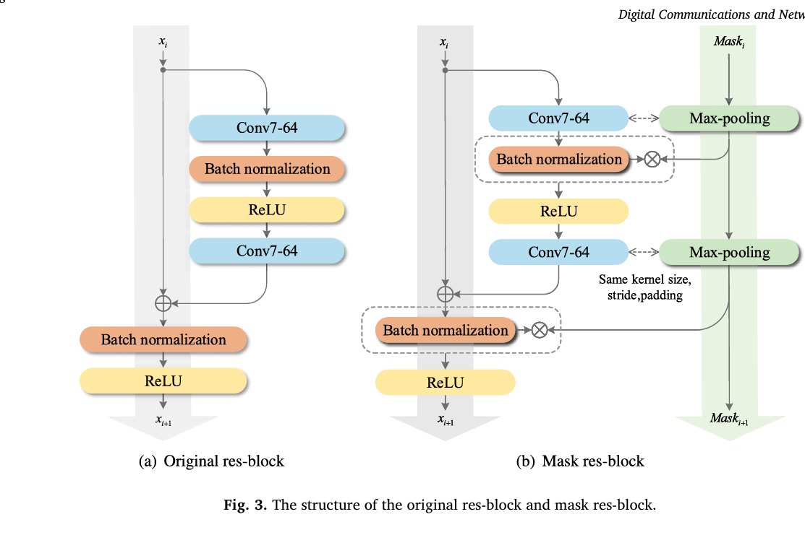
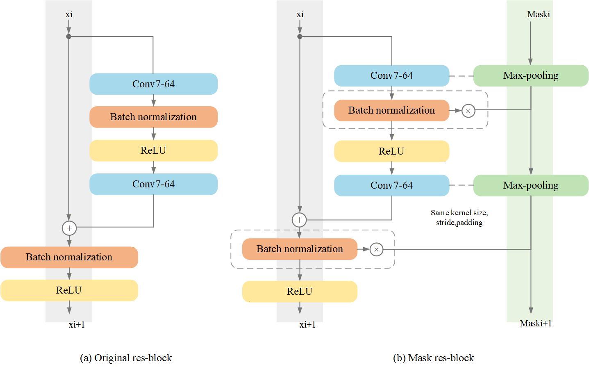
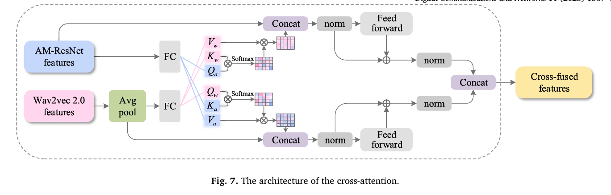
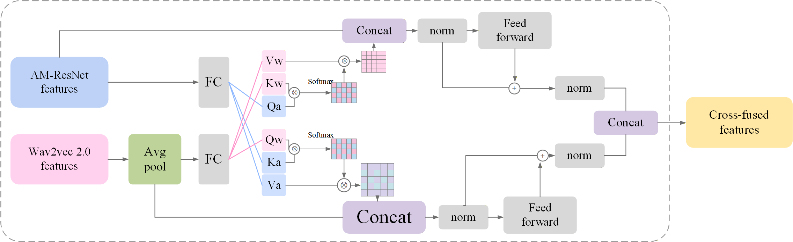
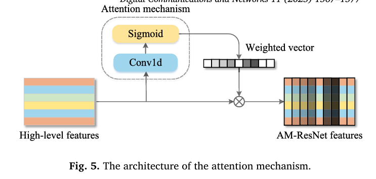
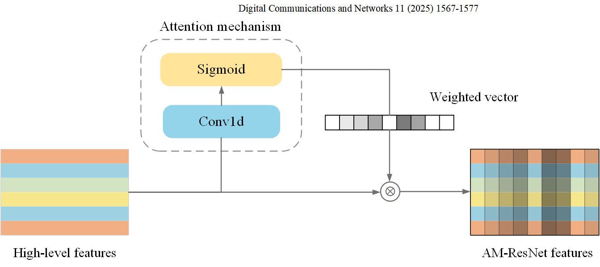
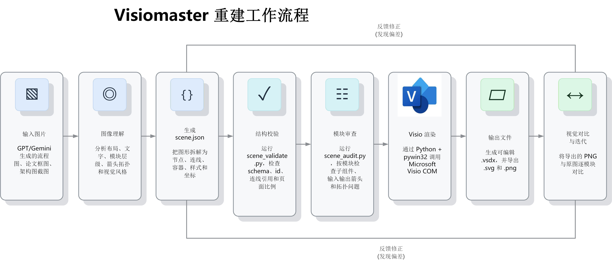

# Scientific Image 2 → Visio optimized edition

This package is a focused optimization of Visiomaster for the workflow:

**paper + references + GPT Image 2 output → Codex multimodal semantic reconstruction → editable VSDX/SVG/PNG**

Start with [INSTALL.md](INSTALL.md) and [SKILL.md](SKILL.md). The original project documentation is retained below for compatibility and implementation detail.

---

# Visiomaster

Visiomaster 是一个 Windows 优先的 Visio 图形重建工具包，也可以作为 Codex Skill 使用。它用于把 GPT、Gemini 等 AI 生成的流程图/学术示意图，以及已有的流程图、架构图、论文模块图，重建为可编辑的 Microsoft Visio 图纸。

它的目标不是把原图整张贴进 Visio，而是把主要结构拆成真正的 Visio 形状、文字、容器、端口和连接线，最终输出可继续编辑的 `.vsdx`，并同时导出 `.svg` 和 `.png` 便于审查。

本项目的流程设计参考了 `ppt-master` 的思路：先做图像理解、结构拆解和风格分析，再通过稳定的中间描述文件驱动确定性的渲染脚本。不同之处在于，Visiomaster 的最终目标是可编辑的 Visio 图纸。

## 能做什么

- 输出可编辑的 `.vsdx`
- 导出高质量 `.svg` 和预览 `.png`
- 用 `scene.json` 描述节点、容器、连线、字体、公式、局部区域和审查元数据
- 支持论文模块图、流程框图、架构图、AI 生成学术框图的可编辑重建
- 支持“原图 vs 复刻 PNG”的视觉审查闭环，把人眼发现的问题转成下一轮重建约束

核心流程：

```text
原始图片
  -> source staging / visual inventory
  -> scene.json
  -> validate / complexity / audit
  -> Visio COM render
  -> vsdx / svg / png
  -> visual LLM review
  -> rebuild brief / regeneration packet
  -> next full-scene rebuild
```

## 本次版本重点

相比上一个公开 release，本版本的重点不是简单增加几个组件，而是把“复刻失败后怎么有效迭代”沉淀成明确流程，并进一步强化局部箭头拓扑的可审查、可映射和可重建：

- 新增源图暂存与哈希记录：`scripts/stage_source_image.py`
- 新增 review bundle 生成：`scripts/make_review_assets.py`
- 新增视觉审查合同和双图审查提示：`references/review-contract.md`、`references/reviewer-two-image-prompt.md`
- 新增 Arrow Plan Gate：严格复刻前先记录 `metadata.arrow_plan`，scene edge 必须用 `arrow_plan_id` 绑定原图箭头事实
- 新增 `rounded_orthogonal_connector`：支持横平竖直但拐角圆滑的正交连接线，避免用全局 smooth 曲线把直线段拉弯
- 新增审查清单 gate：`scripts/review_checklist_gate.py`
- 新增“视觉问题 -> 重建 brief”转换：`scripts/review_findings_to_repair_plan.py`
- 新增下一轮重建包生成：`scripts/prepare_regeneration_packet.py`
- 新增 no-op gate：`scripts/round_noop_gate.py`，避免只改元数据或无效渲染也算一轮进步
- 强化 `scene_validate.py`、`scene_audit.py`、`scene_complexity.py`、`scene_to_visio.py` 对复杂论文图、字体、公式、箭头、区域和严格复刻流程的约束
- 新增 `references/renderer-effective-fields.json`，说明哪些 scene 字段会真实影响渲染

详细更新说明见：

- [docs/updates/2026-05-27-release-prep.md](docs/updates/2026-05-27-release-prep.md)
- [docs/updates/2026-05-28-arrow-plan-gate.md](docs/updates/2026-05-28-arrow-plan-gate.md)
- [docs/updates/2026-05-29-rounded-orthogonal-connector.md](docs/updates/2026-05-29-rounded-orthogonal-connector.md)

## 效果示例

以下示例展示“参考图 -> Visiomaster 重建图”的效果。重建结果来自可编辑 Visio 图纸导出的 PNG，而不是整张贴图。

| 参考图 | Visiomaster 重建图 |
| --- | --- |
|  |  |
|  |  |
|  |  |

更多说明见 [docs/gallery.md](docs/gallery.md)。

## 不想配置环境？

[](http://www.rscoding.site)

如果你只是想体验复刻效果，或者不想自己配置 Windows、Visio、Python、Agent/Skill 环境，也可以通过在线服务有偿体验。上传参考图后，我会按 Visiomaster 流程将流程图、论文模块图或 AI 生成框图重建为可编辑的 Visio 图，并导出 `.vsdx` / `.svg` / `.png` 等文件。

**[点击这里咨询 / 体验复刻效果](http://www.rscoding.site)**

## 环境要求

- Windows
- Microsoft Visio 桌面版
- Python 3.10+
- `requirements.txt` 中的 Python 依赖

安装依赖：

```powershell
python -m pip install -r requirements.txt
```

你可以使用系统 Python、venv 或 conda 环境；只要该环境能导入 `pywin32`，并且可以访问本机安装的 Visio COM 应用即可。

先运行环境自检：

```powershell
python .\scripts\check_visio_env.py
```

自检会尝试启动 Visio、创建一个极简图纸、保存 `.vsdx`，并导出 `.png` / `.svg`。如果这一步失败，需要先修复本机 Visio COM 或导出环境。

## 使用方式

Visiomaster 有两种主要用法：

- 直接作为 CLI 工具使用：手写或生成 `scene.json`，然后用 `scripts/` 下的 Python 脚本校验、审查和渲染。
- 作为 AI 编程助手的 skill/上下文使用：Codex、Claude Code 或其他本地代理都可以读取 `SKILL.md`、引用 `scene.json` 规范，并调用同一套脚本。

真正的硬性要求不是 Codex，而是渲染阶段需要 Windows、Python、`pywin32` 和本机 Microsoft Visio 桌面版。

## 作为 Codex Skill 安装

把本仓库克隆或复制到 Codex 的 skills 目录：

```powershell
git clone https://github.com/<owner>/visiomaster.git "$env:USERPROFILE\.codex\skills\visiomaster"
cd "$env:USERPROFILE\.codex\skills\visiomaster"
python -m pip install -r requirements.txt
```

之后在 Codex 里使用 `$visiomaster`，即可触发“图片到可编辑 Visio”的重建流程。

如果你维护一个工作副本，也可以用同步脚本复制到本机 Codex skill 目录：

```powershell
python .\sync_to_skill.py --skill-dir "$env:USERPROFILE\.codex\skills\visiomaster" --merge-skill-md
```

`--merge-skill-md` 会尽量保留目标 skill 中的本机环境设置。

## 快速开始

校验一个示例 scene：

```powershell
python .\scripts\scene_validate.py .\templates\examples\basic_flow.scene.json
```

生成模块级审查报告：

```powershell
New-Item -ItemType Directory .\exports -Force | Out-Null
python .\scripts\scene_audit.py .\templates\examples\audit_region.scene.json --output .\exports\audit_region.audit.md
```

渲染为 Visio 并导出：

```powershell
python .\scripts\scene_to_visio.py .\templates\examples\basic_flow.scene.json --output-dir .\exports --basename basic_flow
```

从图片生成一个起始版 `scene.json`：

```powershell
python .\scripts\image_to_scene.py --image C:\path\source.png --template basic-flow --output .\work\scene.json
```

注意：`image_to_scene.py` 只是起始场景生成器，不是全自动精确复刻引擎。复杂图仍然需要视觉 LLM 或人工辅助完成结构拆解、局部复核和重建。

## 严格复刻流程

对于论文图、AI 生成框图、复杂架构图，不建议只看导出的整体 PNG。推荐使用严格复刻流程：

```powershell
python .\scripts\stage_source_image.py --input C:\path\source.png --workspace .\work\figure_01 --id figure_01
python .\scripts\scene_validate.py .\work\figure_01\scene.json --strict
python .\scripts\scene_complexity.py .\work\figure_01\scene.json
python .\scripts\scene_audit.py .\work\figure_01\scene.json --fail-on-rebuild
python .\scripts\scene_to_visio.py .\work\figure_01\scene.json --output-dir .\work\figure_01\exports
python .\scripts\make_review_assets.py --original .\work\figure_01\source\original.png --replica .\work\figure_01\exports\figure_01.scene.png --scene .\work\figure_01\scene.json --id figure_01 --round 1 --write-review-bundle --output-dir .\work\figure_01\review_round_01
```

在写第一版 `scene.json` 时，先从原图生成 `metadata.arrow_plan`，逐条记录箭头连接关系、端点、直线/折线/曲线、虚线/实线、箭头头和语义 intent。每条可见 edge 用 `arrow_plan_id` 绑定对应箭头事实，`scene_validate.py --strict` 会检查缺失绑定、水平箭头变斜线、反馈路径组件错误、边界箭头未走 `boundary_port`、merge/fork 未走 junction/bus 等问题。

然后把原图和复刻 PNG 同时交给具备视觉能力的 LLM 审查。审查结果写成 `review_findings.json` 后，再运行：

```powershell
python .\scripts\review_checklist_gate.py .\work\figure_01\review_round_01\figure_01_review_findings.json --manifest .\work\figure_01\review_round_01\figure_01_review_manifest.json --require-failed-refs
python .\scripts\review_findings_to_repair_plan.py .\work\figure_01\review_round_01\figure_01_review_findings.json --scene .\work\figure_01\scene.json --manifest .\work\figure_01\review_round_01\figure_01_review_manifest.json --require-checklists --output .\work\figure_01\review_round_01\figure_01_scene_rebuild_brief.json
python .\scripts\prepare_regeneration_packet.py .\work\figure_01\review_round_01\figure_01_scene_rebuild_brief.json --output-dir .\work\figure_01\review_round_02
```

核心原则：视觉审查必须看“原图 + 当前复刻 PNG”两张图；Python 脚本只做辅助 gate，不能替代人眼/视觉 LLM 的复刻质量判断。

## 工作流程



更详细的流程说明见 [docs/workflow.md](docs/workflow.md)。

## Scene 模型

`scene.json` 是图像分析和 Visio 渲染之间的中间协议。它描述页面尺寸、节点、连线、样式、资源和复刻元数据。

重要参考：

- [references/scene-schema.md](references/scene-schema.md)：`scene.json` 字段、坐标规则、保真元数据
- [references/visio-component-map.md](references/visio-component-map.md)：支持的组件和渲染意图
- [references/visio-export-flow.md](references/visio-export-flow.md)：Visio COM 导出流程和排错
- [references/review-contract.md](references/review-contract.md)：严格复刻审查合同
- [references/reviewer-two-image-prompt.md](references/reviewer-two-image-prompt.md)：双图视觉审查提示
- [references/full-scene-regeneration-prompt.md](references/full-scene-regeneration-prompt.md)：失败后整图重建提示
- [references/renderer-effective-fields.json](references/renderer-effective-fields.json)：渲染器实际生效字段
- [templates/visio_components.json](templates/visio_components.json)：支持的组件词表
- [templates/style_profiles.json](templates/style_profiles.json)：视觉风格配置

## 组件策略

Visiomaster 使用受控的语义组件词表，而不是直接暴露所有 Visio stencil。这样可以减少不同 Office 语言、版本和模板名称带来的不稳定性。

常见节点类型：

- `process_box`、`rounded_process`、`decision_diamond`、`terminator`
- `group_container`、`audit_region`、`boundary_port`
- `feature_map_grid`、`feature_map_banded`、`grid_matrix`、`token_grid`
- `operator_node`、`merge_bus`、`junction_point`、`bracket`
- `classifier_head`、`math_text`、`text_block`、`image_tile`
- `tfr_panel`、`loss_region`、`layer_sequence`、`gated_branch_merge`

常见连线类型：

- `arrow_connector`、`dynamic_connector`、`line_segment`
- `join_connector`、`fork_connector`、`boundary_arrow`
- `residual_connector`、`residual_loop`、`loop_arrow`
- `dashed_feedback_path`、`lane_arrow`、`rounded_orthogonal_connector`

## 仓库结构

```text
visiomaster/
├── SKILL.md
├── README.md
├── LICENSE
├── requirements.txt
├── sync_to_skill.py
├── agents/
├── docs/
│   ├── workflow.md
│   ├── gallery.md
│   ├── updates/
│   └── assets/
├── references/
│   ├── scene-schema.md
│   ├── visio-component-map.md
│   ├── visio-export-flow.md
│   ├── review-contract.md
│   ├── reviewer-two-image-prompt.md
│   ├── full-scene-regeneration-prompt.md
│   └── renderer-effective-fields.json
├── scripts/
│   ├── image_to_scene.py
│   ├── scene_validate.py
│   ├── scene_complexity.py
│   ├── scene_audit.py
│   ├── scene_autofix.py
│   ├── scene_to_visio.py
│   ├── stage_source_image.py
│   ├── make_review_assets.py
│   ├── review_checklist_gate.py
│   ├── review_findings_to_repair_plan.py
│   ├── prepare_regeneration_packet.py
│   ├── round_noop_gate.py
│   ├── font_inventory.py
│   ├── font_utils.py
│   ├── check_visio_env.py
│   └── enumerate_visio_masters.py
├── templates/
│   ├── visio_components.json
│   ├── style_profiles.json
│   └── examples/
└── tests/
```

## 当前限制

- 渲染阶段依赖 Windows 和 Microsoft Visio 桌面版。
- macOS/Linux 可以编辑 `scene.json`、运行部分校验脚本，但不能通过 Visio COM 渲染 `.vsdx`。
- `image_to_scene.py` 只能生成起始场景，不保证自动精确复刻。
- 1:1 精确复刻仍然需要视觉 LLM 或人工审查；脚本 gate 只能检查流程和结构，不等于视觉质量通过。
- 不同 Office/Visio 版本、系统语言、默认字体和导出行为可能存在差异，需要少量适配。

## 兼容性说明

Visiomaster 当前主要面向 Windows + Microsoft Visio 桌面版 + `pywin32` 环境。由于 Visio COM、Office 版本、系统语言、默认 stencil 名称和导出行为都可能不同，其他机器或其他 Visio 版本上可能需要调试。

本项目更适合作为“论文框图/流程图到可编辑 Visio”的工作流和脚本起点，而不是覆盖所有 Visio 版本的商业级全自动转换器。如果你在其他版本的 Visio 上遇到 COM 启动、stencil 查找、导出 PNG/SVG 或连线渲染差异，欢迎通过 issue 反馈环境和复现样例。

示例中的参考图仅用于说明重建任务和效果对比。公开使用时请确保示例图片来源合规；如果不确定论文截图或第三方图片的授权，建议替换为自制图、AI 生成图或明确可公开使用的示例图。

